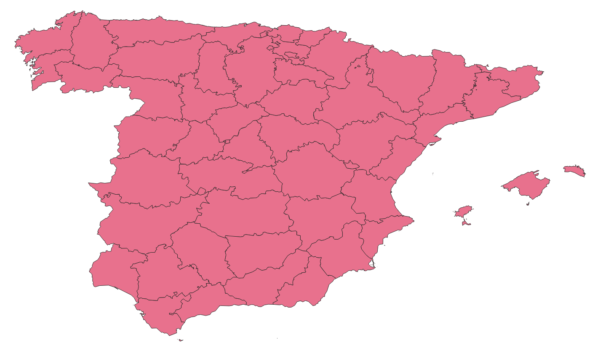
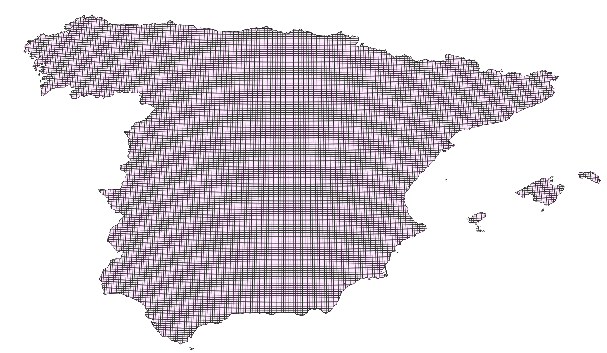

# 🍄🌎 ShroomRadar

## Dataset

### Mushroom data

- *Mushrooms location and timestamps*: use the `fetch_mush_data.ipynb` notebook to download a csv with the location and timestamp of a mushroom species, using the iNaturalist api. 
- *Negative samples and timestamps*: use the `make_negative.ipynb` notebook to generate a csv with random locations and times, to be used as negative classes for the training

### Location grid

- `grid.ipynb` contains the code to generate a gridded geojson. 

Input geometries (spain-provinces.geojson)   |  Output (spain_grid_3km.geojson)
:-------------------------:|:-------------------------:
  |  

### Climate data

- `get_climate_data.ipynb` contains the code necessary to download the climate data relative to the mushroom data obtained in the previous section
- `append_climate_data.ipynb`: code to append the climate data to the geometry geojson

### Environmental data

- *Elevation data (NASA SRTM V3 product)* : `append_elevation.ipynb`
- *Corine map*: `LC.ipynb` 

## Training code

- *GradientBoostingClassifier*: code to train the model is in `train_model.ipynb`